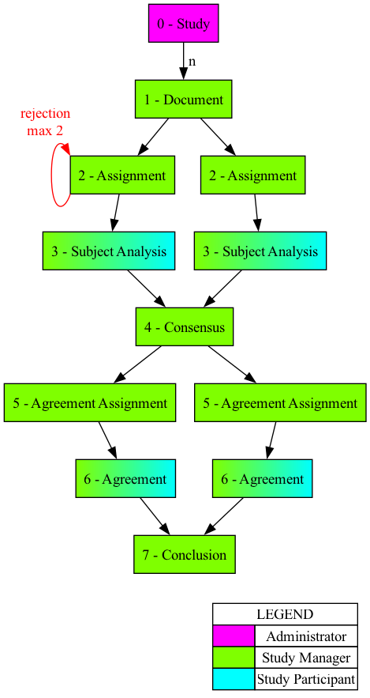

# AI Indexing Study

A Drupal suite (Recipe + Module) to assess automated ("robot") indexing of
medical journal articles. With a team of subject specialists, researcher expectations of concepts represented in
indexing are solicited, validated, and then compared to actual indexing.

> [!IMPORTANT]
> Do not install this module alone. A Drupal Recipe exists to deploy this module
with necessary Drupal configurations. See Installation, below.

## Workflow Overview

User Roles:
* Administrator
* Study Manager
* Study Participant

### 0 - Study
A **Study** has a name, description, and set of Drupal Users who
are part of this Study. Creating or editing Studies is done by an Administrator.

### 1 - Document
**Documents** are uploaded into a Study. They should be in the
XML format that comes from an OVID download. The maximum uploadable file size
depends on server configuration. This step is done by a Study Manager.
[SEE BELOW FOR FEEDS CONFIGURATION AND OVID FIELDS THAT MUST BE THERE]

### 2 - Assignment
Create **Assignments**. Each Document is assigned to two different Users for
Subject Analysis. During the assignment process it is possible to select all,
or a subset, of the Users who are part of the study. The documents will be
assigned at random to eligible Users within that selection, if possible, and
will cause an error otherwise. This step is done by a Study Manager.

### 3 - Subject Analysis
Perform **Subject Analysis**. When a User clicks "Analyze", a random Document
assigned to them is presented, displaying its title, abstract, and journal
title. In this study, the User identifies free-form topics present in the
Document that should be represented in the MeSH terms. There is also an option
at this stage to reject a document as out of scope (see Rejection Workflow,
below). After two (2) Subject Analyses have been performed on a
Document, a document is eligible for Consensus.

### 4 - Consensus
Create **Consensus**. During Consensus, both Subject Analyses
(lists of concepts) are presented and the User merges the lists (using
their judgement) into a final list of human-generated concepts applied to this
Document. This step is performed by the Study Manager(s), ideally
collaboratively.

### 5 - Agreement Assignment
**Agreement Assignments** are created automatically when a Consensus is created.
Each Document is assigned to two (2) different Users for Agreement. If possible,
these are different Users than created the Subject Analyses for that Document.
 [TODO: Make sure a use who rejected it doen'st see it at this stage]

### 6 - Agreement
Determine **Agreement**. Do the MeSH terms assigned by the robot represent the
human-generated consensus concepts? The Study Participant performing this step is
asked a number of questions such as whether terms were missing from the MeSH,
whether terms are erroneously present, there are errors of precision, or if the
"robot did better".

### 7 - Conclusion
After two Agreements, a Study Manager can create a **Conclusion** summarizing
the two Agreements by noting whether there was agreement between the Agreement
creators, whether the indexing was acceptable, and answering the same questions
as were posed in the Agreement stage. This step is performed by the Study
Manager(s), ideally collaboratively.

### 8 - Results
Finally, the **results** of _completed_ documents can be viewed in a Drupal table,
or downloaded as a CSV either with pipes ('|') separating multiple values in a column (
for programmatic analysis) or with newlines separating multiple values (better
for human reading). Any user who is part of a study may download Results.

### Rejection Workflow

During the Subject Analysis phase, a reviewer may reject a document as out of
scope. This will send it back for Assignment for a (potential) third opinion.
If a document receives two (2) rejections, it will be classed as Rejected. If on
the other hand it receives two (2) completed Subject Analyses, then it will be
considered part of the study.

It is possible for a document to be Rejected and have an outstanding Assignment,
but that Assignment will not be completed.

# Installation

* Install the recipe, rosiel/indexing_study_recipe.
